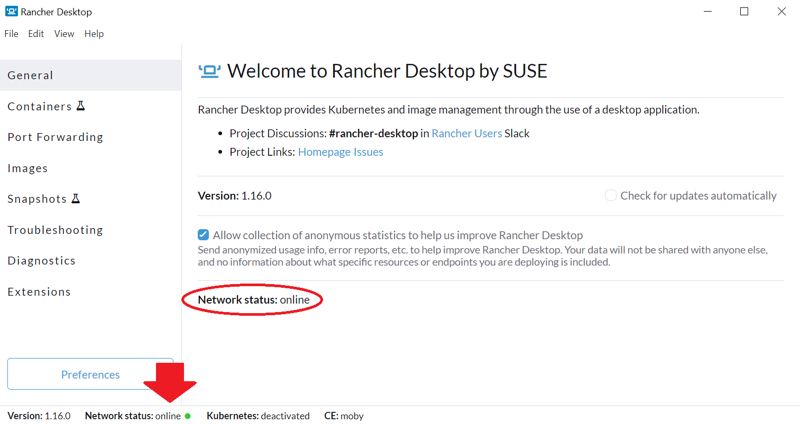
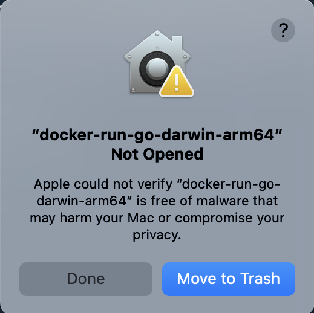
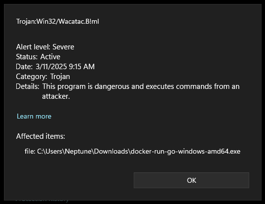

### Troubleshooting
---

This page outlines and attempts to offer solutions to various issues team members have run into while using the CLI tool. If you run into any issues not listed here, please email us at fortinetcloudcse@fortinet.com so we may research it and include information and solutions here. 

### General/Common Docker Permissions Issue in Linux

When working with Docker in Linux, you may encounter an error like the following:

```bash
docker images

# permission denied while trying to connect to the Docker daemon socket at unix:///var/run/docker.sock
```

This issue indicates there is a permissions issue preventing the Docker CLI (api client) from communicating with the Docker daemon. To resolve it, ensure your docker.sock permissions look like the following:

```bash
ls -la /var/run/docker.sock

#srw-rw---- 1 root docker 0 May 28 09:41 /var/run/docker.sock=
```
If they don't match what you see here, run:

```bash
sudo chmod 660 /var/run/docker.sock

sudo chown root:docker /var/run/docker.sock
```

Then, add your user account to the *docker* group:

```bash
sudo usermod -aG docker $USER
```

In order for the change to become effective, you will then need to **log out** of your terminal session and log back in. The quickest way to do this is to close your terminal window and re-open it. However, if working in a code editor such as VS Code, closing and re-opening may not be sufficient and you may need to completely log out of your Linux session and log back in (or just completely reboot).

After logging back in, check that your account has been added to the **docker** group:

```bash
groups
# ... group7 group8 docker
```

### Windows Docker Issue

If you try to issue Docker commands in Windows specifically and you see this error:

```bash
...docker_engine/ping: open //./pipe/docker_engine: The system cannot find the file specified.
```

It means the Docker CLI is trying to connect to the daemon, but the pipe (communication channel) does not exist--usually because the Docker daemon isn't running. 

To resolve the issue, first ensure you have Docker running. If you're using Rancher, ensure "Network Status" is **online**.





You can also check that the API client is available in your terminal environment by running **docker images**. 

```bash
docker images

#REPOSITORY            TAG          IMAGE ID       CREATED         SIZE
#fortinet-hugo         latest       89d81e91a4c6   3 hours ago     597MB
#hugomods/hugo         std          2d5893e404be   2 days ago      498MB
....
```

If you can verify Docker is running and the API client is reachable and you're still receiving the error message above, try the following:

1. Try restarting your Docker Windows application (Rancher, etc.)

2. Check your Docker Context:

```bash
docker context ls

docker context use rancher-desktop   # if using rancher, for example
```

3. Try rebooting the machine.

### Permissions Issues

#### MacOS

Some users have reported receiving system warnings such as the following when working with the tool in Mac:



There is a resolution detailed [here](https://support.apple.com/en-in/102445#:~:text=If%20you%20want%20to%20open,anyway%2C%20you%20can%20click%20Open.):

1. Open System Settings.

2. Click **Privacy & Security**, scroll down and look for the CLI tool binary. Click **Open Anyway** next to it.

3. When the warning prompt reappears, click **Open**.

#### Windows

Some users have reported an issue in Windows where running the file results in the following warning from Windows Defender/AntiVirus:



This is uncommon and typically a **false positive** due to Go-compiled binaries often being misidentified by heuristic antivirus engines, especially if they are not often seen in the wild. If you run into this, please email us at fortinetcloudcse@fortinet.com.


