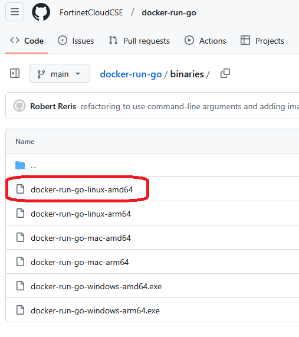
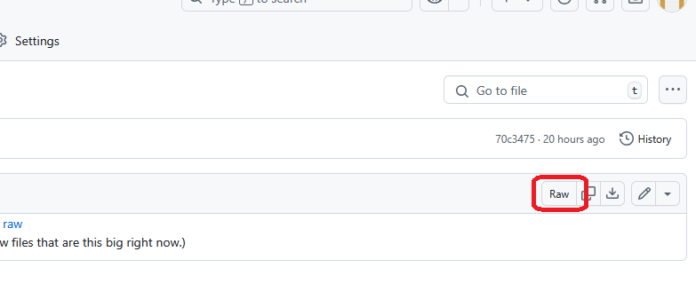

## The docker-run-go CLI Tool

The [docker-run-go](https://github.com/FortinetCloudCSE/docker-run-go/) CLI tool is a helper CLI tool that currently supports workshop development workflows with the following capabilites:

* Creation of team Docker development images
* Launch of live Hugo server Docker container for workshop development

You can download the binary for your OS and architecture specifications from the repo. Binaries are available for Windows, Mac, and Linux. The following commands will help you determine your system architecture.

### Windows

Run:

```shell
C:\\wmic os get OSArchitecture
```

Output:
```shell
OSArchitecture
64-bit
```
If your architecture is **64-bit**, you'll want to download an **amd64** binary.

If your architecture is **32-bit**, you'll want to download a **386** binary.

### Linux or MacOS

Run:

```shell
> uname -m
```

Output:

```shell
x86_64
```

| If your output is:  | Your Go Architecture is:|
| ------------------  | ----------------------- |
| x86_64              | amd64                   |
| i386 or i686        | 386                     |
| aarch64             | arm64                   |
| armv71              | arm                     |

Once you have your architecture, you can navigate to the **binaries** folder of the repo to download the binary.

### Downloading the Binary

Click on the name of the binary in the binaries folder (located [here](https://github.com/FortinetCloudCSE/docker-run-go/tree/main/binaries)).

For example, if your Go architecture as found above x86_64 and you're working in Linux, your binary would be this one: 

<br><br>



From this page, right click "Raw", and choose "Save Link As", and choose a convenient location.



Once the binary is downloaded, you can either run it from your workshop directory, or (recommended) copy it into your system path. If you copy it into your system path, it will be available throughout your system and you won't need to copy the binary anywhere else to run it.

To find your system path on Windows:

```shell
C:\\echo %PATH%
``` 

Output:

```shell
C:\Windows\system32;C:Windows;C:\Program Files; .....
```

To copy the binary into your system path, choose a location listed, and move it there:

```shell
C:\\move docker-run-go-windows-amd64.exe "C:\Program Files"
```
To find your system path on Linux or MacOS:

```shell
> echo $PATH
```

