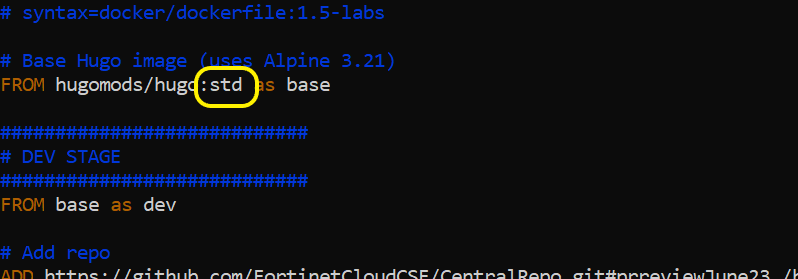

## New Go Utility for interacting with Container
---

The [fortihugorunner](https://github.com/FortinetCloudCSE/fortihugorunner/) CLI tool is a helper CLI tool that currently supports simplified workshop authoring on any Windows, MacOS, or Linux system with the following capabilities:

* Same usage across different development platforms
* Creates (builds) Fortinet Cloud CSE Docker development images
* Launches local Docker container with Hugo web server and live updating view of rendered site as modifications are made and saved

You can download the binary for your OS and architecture specifications from the repo. Binaries are available for Windows, Mac, and Linux. The following sections will walk you through downloading the appropriate binary and setting up the tool in your environment.


{}

You must have Docker installed and running to use this tool. You also need to verify that the Docker API Client is reachable from the terminal environment where you'll be running it. In Windows and Mac, [Rancher Desktop](https://docs.rancherdesktop.io/getting-started/installation) is recommended for working with Docker. In Linux, installation instructions for various distributions may be found [here](https://docs.docker.com/engine/install/). 

Some information on common issues you may run into while getting started with Docker can be found on the [troubleshooting](clitroubleshooting.html) page. If you have any questions or need any help getting set up, please reach out to the FortinetCloudCSE team at fortinetcloudcse@fortinet.com.

{}

### fortihugorunner flows

Here's a visual of what's happening when we use this new tool:



### System Architecture determination and binary download


{}
Run this command from the Windows Command Prompt to find your OS Architecture 

```shell
echo %PROCESSOR_ARCHITECTURE%
```

Depending on your output, download the appropriate Go Binary from the [releases page](https://github.com/FortinetCloudCSE/fortihugorunner/releases/):

| If your command output is:    | then download:                  |
|:-----------------------------:|:--------------------------------|
| AMD64                         | fortihugorunner-windows-amd64.exe | 
| x86                           | fortihugorunner-windows-386.exe   |

{}
{}
Run the following to get your OS Architecture:

```shell
uname -m
```

Depending on the output, download the appropriate Go Binary from the [releases page](https://github.com/FortinetCloudCSE/fortihugorunner/releases/):

| If your command output is:    | then download:                         |
|:-----------------------------:|:--------------------------------------:|
| x86_64                        | fortihugorunner-<darwin/linux>-amd64.exe | 
| arm64                         | fortihugorunner-<darwin/linux>-arm64.exe |

{}


### Utility Setup

You should place the downloaded binary at the root of your Hugo development folder so it's in a **well-known location**.  This will make replacing and/or upgrading the utility easier.

{}
If you use /home/ubuntu/pythonProjects/ for all of your Hugo development, and you clone repos into this folder structure, you should place the Go Utility here as your **well-known location**
{}

Further, adding this **well-known location** to your system's $PATH will enable you to run the utility on any repo you edit.



{}
{}
In the following examples, we'll use **C:\users\someUser\pythonProjects** as our **well-known-location**
{}


{}
To show and change your system path using Windows CLI do the following:
```shell
echo %PATH%
setx PATH "%PATH%;C:\users\someUser\pythonProjects"
echo %PATH%
``` 
{}
The `echo %PATH%` command lists your existing $PATH variable before and after the `setx` change.  Be careful with `setx` as it replaces the `PATH` value, not appends (though `%PATH%` includes the existing value).
{}
{}
{}
To show and change your system path using Windows Powershell do the following:

```shell
$env:Path
[Environment]::SetEnvironmentVariable("Path", $env:Path + ";C:\users\someUser\pythonProjects", [EnvironmentVariableTarget]::User)
$env:Path
```

{}
{}

{}
{}

To find your system path on Linux or MacOS:

```shell
echo $PATH
```

To add your **well-known-location** to the system path, edit the ```etc/environment``` file and append the **well-known location** for the Go Utility.  The following commands show you how to do this using nano editor:
{}
In the following examples, we'll use **/home/ubuntu/pythonProjects** as our **well-known-location**
{}

1. Open the File
    ```bash
    sudo nano etc/environment
    ```
2. Find the PATH line and append your **well-known location** where the Go Utility binary is stored, to the end of the existing line, making sure to retain the end <kbd>"</kbd>

    **append __/home/ubuntu/pythonProjects/__ to the end of the following line as so:**
    
    ```bash
    PATH="/usr/local/sbin:/usr/local/bin:/usr/sbin:/usr/bin:/sbin:/bin:/home/ubuntu/pythonProjects/"
    ```
3. Save file and exit nano editor with: <kbd>CTRL</kbd>+<kbd>X</kbd>, then <kbd>Y</kbd>, then <kbd>Enter</kbd>
4. Apply the file changes to your current terminal session
    ```bash
    source /etc/environment
    ```
5. Verify the change
    ```bash 
    echo $PATH
    ```
   
6. Finally, make sure the Go Binary is executable:
   ```bash
   chmod +x /home/ubuntu/pythonProjects fortihugorunner
   ```
{}


### Running the utility

Once the binary is downloaded, you can either run it from your workshop directory, or (recommended) copy it into your system path. If you copy it into your system path, it will be available throughout your system and you won't need to copy the binary anywhere else to run it.
You can use the following CLI arguments to modify the utility's behavior.  If you run the utility from an existing Hugo repo directory, **leaving the CLI blank will run with defaults listed**

The filename of the binary as downloaded will contain the OS and architecture it was compiled to, i.e. fortihugorunner-windows-amd64.exe. If you would like to trim the platform information from the binary, use the rename command:

```bash
fortihugorunner rename
# renamed fortihugo-runner-linux-amd64.exe to fortihugorunner.exe
```

General steps:
1. Run the Utility to **BUILD** your container.  This step is only necessary when we've added features or capabilities within the container.  Rebuilding pulls the latest/greatest into your container image
2. For Any repo you want to edit, run the utility with ```launch-server``` command to get a local live-updating view of your Hugo workshop site.

CLI options with defaults for **Container BUILD**
```shell
fortihugorunner build-image \
    --env admin-dev       # testing image, used for container/process development, named ```hugo-tester```
    --env author-dev      # daily-use image for workshop authoring, named ```fortinet-hugo```
```

CLI Options with defaults for **Container RUN**
```shell
fortihugorunner launch-server \

**OPTIONAL COMMANDS TO ALTER DEFAULT BEHAVIOR.  OMIT THESE OPTIONS FOR MOST SCENARIOS**

  --docker-image fortinet-hugo:latest \
  --host-port 1313 \
  --container-port 1313 \
  --watch-dir .
  --mount-toml
```

For each component (build-image, launch-server, etc.), there are help menus available which explain the various parameter flags available.
```shell
fortihugorunner -h

#Includes functions for facilitating Hugo app development with docker containers.

#Usage:
#  fortihugorunner [flags]
#  fortihugorunner [command]

#Available Commands:
#  build-image   Builds a Docker image programmatically using the Docker SDK
#  help          Help about any command
#  launch-server Launch the Hugo server container
#  version       Print fortihugorunner version.

#Flags:
#  -h, --help      help for fortihugorunner
#  -v, --version   fortihugorunner version information

#Use "fortihugorunner [command] --help" for more information about a command.

fortihugorunner build-image -h
fortihugorunner launch-server -h
```

There is also a version flag to display the current version of the tool being used. A [CHANGELOG](https://github.com/FortinetCloudCSE/fortihugorunner/blob/main/CHANGELOG.md) is available in the tool repository for information on version updates and features.

```shell
fortihugorunner -v

#Version: v0.3.2
#Date: 2025-05-13
#Platform: linux/amd64
```

To update your local binary executable to the latest version, use the update command.

```bash
fortihugorunner update
# Successfully updated to version 0.5.0! 
```


{}
1. Navigate to your workshop repo directory and run the utility (which is 1 level up in your development root/**well-known-location**).  
  - In the example below, we are working on UserRepo located at ```C:\users\someUser\pythonProjects\UserRepo```
2. Build the Docker image
3. Launch Hugo server in Author Mode

```shell
cd C:\users\someUser\pythonProjects\UserRepo
..\fortihugorunner.exe build-image --env author-dev
..\fortihugorunner.exe launch-server
```

{}
{}
1. Navigate to your workshop repo directory and run the utility (which is 1 level up in your development root/**well-known-location**).  
  - In the example below, we are working on UserRepo located at ```/home/ubuntu/pythonProjects/UserRepo```
2. Build the Docker image
3. Launch Hugo server in Author Mode

```shell
cd /home/ubuntu/pythonProjects/UserRepo
../fortihugorunner build-image --env author-dev
../fortihugorunner launch-server
```
{}


#### Important note on the Go Docker SDK

This utility leverages a Go Docker client from the [Moby project](https://github.com/moby/moby), commonly referred to as the [Docker SDK for Go](https://pkg.go.dev/github.com/docker/docker/client) to interact with the Docker daemon programmatically. The SDK doesn't always initiate an implicit pull of missing base images when building from a Dockerfile as is the case when running **docker build** from the command line. If any base images needed or referenced in your workshop Dockerfile aren't already present locally, the image build will fail with an error message along the lines of *failed to resolve source metadata...*. 

To resolve this, the utility explicitly checks for the presence of any base images before starting the build process and pulls them programmatically if they're not present. At the moment, the only two required images are:

* docker/dockerfile:1.5-labs
* docker.io/hugomods/hugo:std

A parameter is available in the **build-image** component to change the tag of the hugomods image to pull if necessary. An example is shown below.
```shell
./fortihugorunner build-image --env ... --hugo-version 0.146.0
```

This argument is set to **std** by default. It is important to ensure that it matches the tag used in your workshop Dockerfile.


