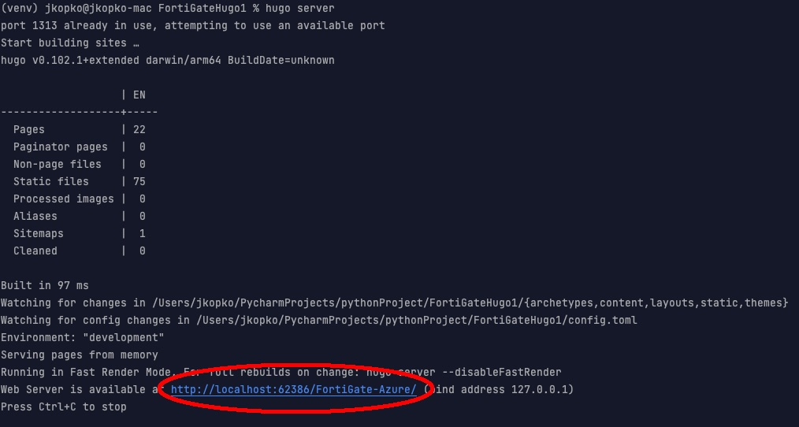

{} Hugo is installed on the container so it's best to use it there.  These instructions are included for legacy learning purposes {}

### Hugo Local install 

If you're using a Mac, run the following brew install from your terminal

```sh
brew install hugo 
```

If you're using Windows, install chocolatey for windows ([follow directions here](https://chocolatey.org/install)).  Once installed run the following

```sh
choco install hugo -confirm
```

#### Run Hugo webserver locally to see a local version of the rendered website

From within the root of the repo you copied onto your system

```sh
hugo server
```

* Click on the URL presented after the above command finishes to view a local version of your first Hugo formatted website


    


{}
<p style='text-align: left;'>
The examples and sample code provided in this workshop are intended to be consumed as instructional content. These will help you understand how various Fortinet and Azure services can be architected to build a solution while demonstrating best practices along the way. These examples are not intended for use in production environments without full understanding of how they operate.
</p>
{}