### The Jenkins PAT

The Jenkins personal access token is used by Jenkins to retrieve Git repo information and send status checks during pipeline runs.

To generate a new token, navigate a web browser to the team [Github](https://github.com/FortinetCloudCSE), and click the  at the top right of the screen.

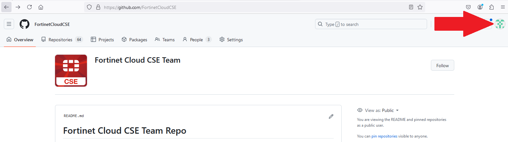

Click 'Settings' in the dropdown.

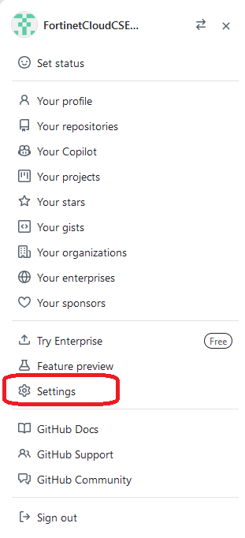

At the bottom left of the ***Settings*** page, click 'Developer Settings.'

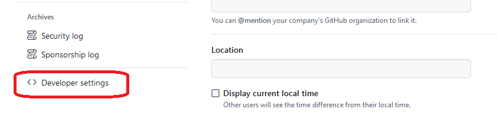

Click the 'Personal access tokens' dropdown, and click 'Tokens (classic)'.

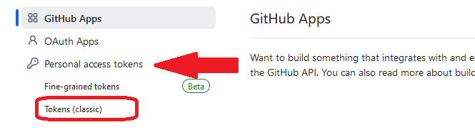

### Generating a New Token

To generate a new token, follow these steps. If you just need to regenerate an existing token, skip down to the following section.

To generate a new token, click the 'Generate new token' dropdown near the top right of the ***Personal access tokens (classic)*** screen. In the dropdown, click 'Generate new token (classic).'

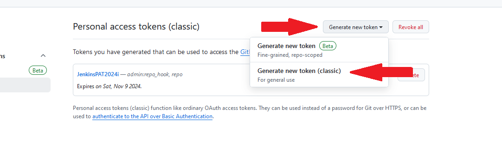

You will be prompted to enter your FortiAuthenticator TOTP code. Enter it, and on the ***New personal access token (classic)*** page, ensure the following permissions are checked:

- ***repo*** and all of its sub-options:

  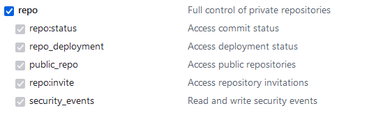

- ***admin:repo_hook*** and all of its sub-options:

  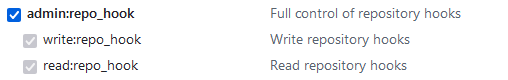

Choose an expiration date, optionally add a note, and click  at the bottom of the screen.

***Note: When the token appears on the next screen, ensure you copy and paste it somewhere where you can retrieve it before navigating away from the screen or closing the tab. Once you do, you will not be able to retrieve the token again and will need to generate another.***

### Regenerating an Existing Token

To regenerate an existing token, from the ***Personal access tokens (classic)*** screen, click the name of the token. For example:

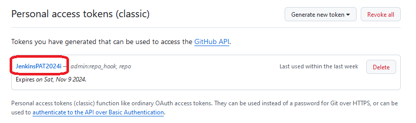

On the following screen, ensure the requisite permissions are selected, and click 'Regenerate token', and copy the token someplace handy where you can retrieve it later.

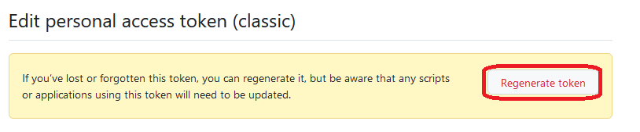

### Updating Jenkins

Navigate to the FortinetCloudCSE Jenkins [server](https://jenkins.fortinetcloudcse.com:8443), and login with your credentials. To update a token, you'll need admin permissions.

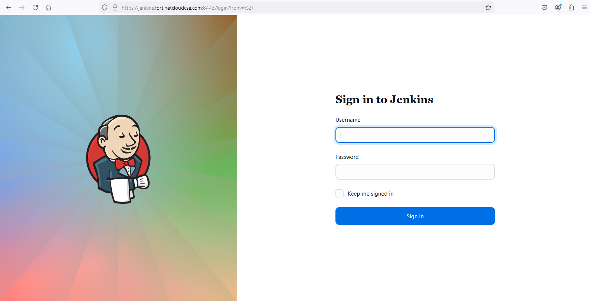

After logging in, click 'Manage Jenkins' on the left hand side of the screen.

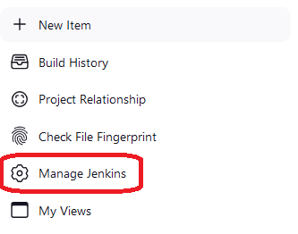

On the ***Manage Jenkins*** screen, under the ***Security*** heading, click 'Credentials'.

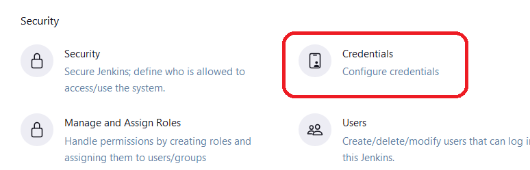

On the ***Credentials*** page, click the name of the token you want to update. Then, click 'Update' on the left menu.

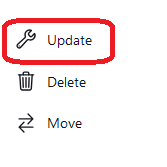

Click 'Change Password', paste in the new token, and click .

### Confirm the token works

Click the 'Manage Jenkins' breadcrumb at the top of the screen.

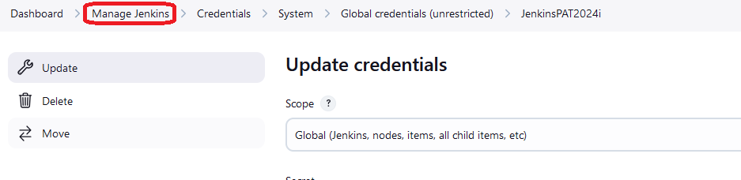

Click 'System' under the ***System Configuration*** heading on the ***Manage Jenkins*** page. 

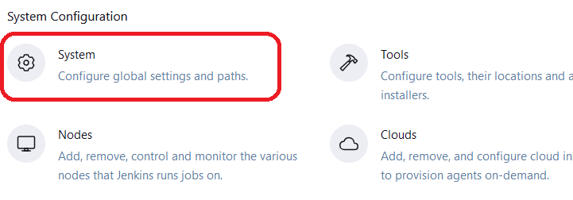

Scroll down to the ***Github*** section towards the center of the page.

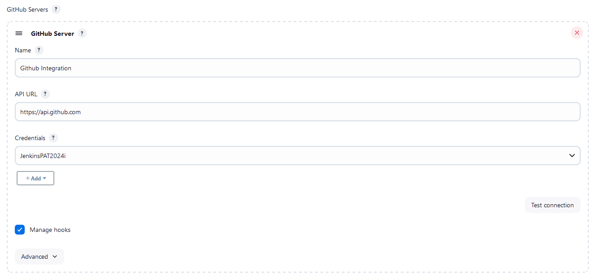

Select the credential that references the token you just updated, and click 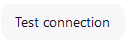.

If the token is valid and working, you should see a message appear such as **Credentials verified for user...** as in the image below.

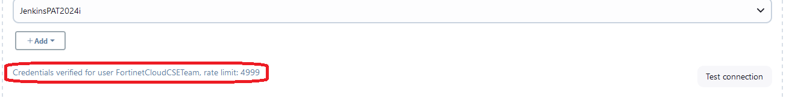

